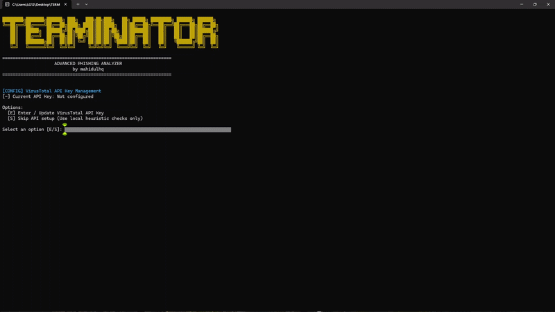

<p align="center">
  
</p>

# TERMINATOR

TERMINATOR is a command-line threat intelligence tool designed to analyze URLs for potential phishing indicators, domain typosquatting, and suspicious hosting patterns. It performs multi-layered heuristic analysis and optionally queries the VirusTotal API v3 for threat data.

 

## Features

* **Protocol Inspection:** Identifies unencrypted HTTP endpoints.
* **IP-Based Host Detection:** Flags requests targeting direct IP addresses rather than registered domain names.
* **Entropy Analysis:** Measures domain string randomness using Shannon entropy algorithms to detect Algorithmically Generated Domains (DGA).
* **Homograph & Typosquatting Detection:** Identifies Punycode (IDN) obfuscation and calculates Levenshtein distances against target commercial brands.
* **Redirect Tracing:** Follows HTTP redirection chains to expose final destination URLs.
* **VirusTotal Integration:** Optional reputation lookup via VirusTotal API v3.
* **Interactive Configuration:** Dynamic API key prompting with persistent `.env` storage.


## Prerequisites

* **Python:** Version 3.8 or higher.
* **VirusTotal API Key (Optional):** Required for live vendor reputation lookups. Local heuristic checks operate without an API key.

 

## Installation

1. **Clone the repository:**
```bash
git clone [https://github.com/your-username/terminator.git](https://github.com/your-username/terminator.git)
cd terminator

```


2. **Install dependencies:**
```bash
pip install -r requirements.txt

```


 

## Usage

### Interactive Execution (Main Loop)

Run the script directly to start the interactive loop:

```bash
python terminator.py

```

* **API Setup:** Checks for a local `.env` file containing `VT_API_KEY`. Prompts for setup if missing.
* **Continuous Scanning:** Keeps the session active so you can analyze multiple URLs sequentially without restarting the application.
* **Menu Options:**
* Enter any URL to run instant analysis.
* Enter `K` to update or reconfigure your VirusTotal API key.
* Enter `Q` (or `QUIT` / `EXIT`) to exit the application.


### Command-Line Arguments (Single-Scan Mode)

To run a one-time analysis and exit immediately (ideal for automation or external scripts), pass the target URL as an argument:

```bash
python terminator.py [http://example-phishing-domain.com](http://example-phishing-domain.com)

```

### One-Click Script Launchers

The launch scripts automatically handle relative directory navigation, verify Python prerequisites, install missing dependencies, and launch `terminator.py`:

* **Windows:** Double-click ` scripts/run.bat` or run from PowerShell:
```powershell
.\scripts\run.bat

```


* **Linux / macOS:** Make the script executable and run:
```bash
chmod +x  scripts/run.sh
./scripts/run.sh

```


 

## Pre-Compiled Releases

Pre-compiled binaries for Windows environments are hosted under the **Releases** section of this repository.

To download pre-built executables:

1. Navigate to the **Releases** section on the right sidebar.
2. Select the latest release version.
3. Download `TERMINATOR.exe` from the attached release assets.

 

> [!WARNING]
> # Security Notice: False Positive Antivirus Detections
> 
> 
> When compiling or running the single-file executable (`TERMINATOR.exe`), **Windows Defender** or other antivirus engines may display a warning or flag the file as suspicious (e.g., `Trojan:Win32/Wacatac.B!ml` or generic heuristic flags).
> **TERMINATOR is completely safe to run. This is a 100% false positive.**

 

### Why Does This Detection Happen?

1. **Pre-Compiled Bootloader Signatures:** Standard Python compilation tools (such as PyInstaller) pack the application script, dependencies, and a lightweight C bootloader into a single executable wrapper. Because malware developers frequently use these same default tools to package malicious code, security vendors create broad heuristic signatures matching PyInstaller's pre-compiled bootloader binaries.
2. **Dynamic Script Execution & Web Requests:** TERMINATOR inspects URLs, resolves redirects using HTTP requests, and queries threat intelligence APIs (VirusTotal). Antivirus engines automatically flag unknown executables that perform outbound network requests without an expensive commercial code-signing certificate.
3. **Lack of Digital Signature:** The binary is built locally and is not signed with an EV Code Signing Certificate (which costs hundreds of dollars annually). Windows Defender automatically treats unsigned standalone executables from independent developers as unverified software.

 

### How to Bypass / Ignore the Warning on Windows

#### Option 1: Allow the File in Windows Security (Recommended)

1. Open **Windows Security** from your Start Menu.
2. Go to **Virus & threat protection** > **Protection history**.
3. Locate the blocked item corresponding to `TERMINATOR.exe`.
4. Click **Actions** and select **Allow on device**.
5. Re-run `TERMINATOR.exe`.

#### Option 2: Add a Folder Exclusion

If you regularly build or update the project, add the project folder to your Windows Defender exclusions list:

1. Go to **Windows Security** > **Virus & threat protection**.
2. Under **Virus & threat protection settings**, click **Manage settings**.
3. Scroll down to **Exclusions** and click **Add or remove exclusions**.
4. Click **Add an exclusion** > **Folder**, and select your `TERMINATOR` directory.

 

### Verifying the Source Code

Because TERMINATOR is fully open-source, you can inspect the full script directly in `terminator.py` to verify that no malicious operations are performed. Alternatively, you can always run the tool directly via Python using:

```cmd
python terminator.py
```